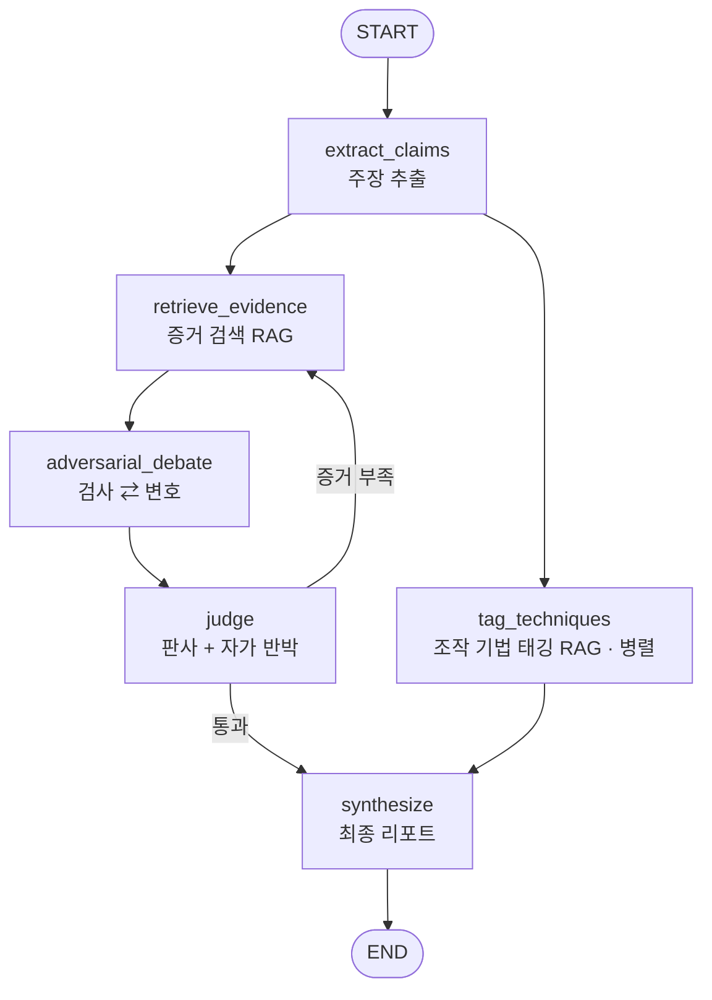

# Rumor Verification Agent

> 클라우드AI프로그래밍 기말 프로젝트 · LangChain / **LangGraph** 멀티에이전트 + RAG · 채팅은 **외부 LLM**, 임베딩은 **Gemini** (하이브리드)

단톡방·SNS로 퍼지는 뉴스·루머를 받아 **검증 가능한 주장**을 뽑고, RAG로 근거를 모아
**검사·변호·판사 에이전트의 적대적 토론**과 **자가 반박 루프**를 거쳐
**신뢰도 등급 · 근거 사슬 · 조작 기법 태그 · 반론 카드**를 돌려주는 코치형 에이전트입니다.

단정적 라벨만 내놓는 분류기가 아니라 *"왜 헷갈리게 만드는지 + 어떻게 반박할지"* 까지
알려주어 사용자의 미디어 리터러시를 키우는 것을 목표로 합니다.

---

## 1. 워크플로우 (LangGraph StateGraph)



- **6개 노드**: `extract_claims → retrieve_evidence → adversarial_debate → judge → (루프 or) synthesize`, 그리고 `tag_techniques`는 병렬 분기.
- **멀티에이전트**: 검사 / 변호 / 판사 / 기법 태거 / 반론 작성(코치) — 한 LLM에 역할별 시스템 프롬프트로 구현.
- **자가 반박 루프**: 판사가 증거 부족이라 판단하면 `retrieve_evidence`로 되돌아가며, 4가지 핵심 종료 조건(최대 루프·판사 만족·신규 증거 없음·신뢰도 수렴)으로 무한루프/진동을 막습니다.

## 2. 안전 설계 (환각·오판 방지)

- 검사·변호는 **실제 회수된 스니펫만 인용**하도록 프롬프트로 강제하고, **코드 레벨에서 지어낸 인용 id를 제거**합니다(이중 방어).
- 판사는 출처 없는·신뢰도 낮은 주장을 **감점**하고, **"불충분(판단 불가)"** 를 정식 결론으로 허용합니다(프롬프트 유도).
- 출력은 단정 라벨이 아니라 **5단계 신뢰도 등급**(사실 / 대체로 사실 / 불충분 / 대체로 거짓 / 거짓·오도)입니다.
- 최종 리포트의 핵심 수치(종합 등급·근거 출처)는 **Python에서 결정론적으로 계산**하고, LLM은 자연어 반론 카드만 작성합니다.

---

## 3. 설치 (조교/채점자 안내)

> **요구사항**: Python **3.12** 권장(3.11~3.13), 인터넷 연결, 그리고 키 2개 —
> 채팅용 **외부 LLM API 키**(`LLM_API_KEY`)와 **임베딩용 Gemini 키**(`GOOGLE_API_KEY`).
> 본 에이전트는 채팅은 외부 LLM, 임베딩(RAG)은 Gemini 를 쓰는 **하이브리드** 구성입니다.

```bash
# 1) 가상환경 생성 및 활성화
python3.12 -m venv .venv
source .venv/bin/activate          # Windows: .venv\Scripts\activate

# 2) 의존성 설치
pip install -r requirements.txt
pip install -e .                   # factchecker 패키지 설치(개발 모드)

# 3) 환경변수 설정 — .env 생성 후 키 입력
cp .env.example .env               # Windows: copy .env.example .env
#   .env 를 열어 LLM_API_KEY(채팅용 외부 LLM 키)와 LLM_MODEL(제공받은 모델 ID)을 입력하세요.
#   임베딩용 GOOGLE_API_KEY 도 채우세요.
```

> ⚠️ **제출본의 `.env.example` 에는 키가 `YOUR-API-KEY-HERE` 로 비워져 있습니다.**
> 실제 키는 `.env` 에만 넣으며, `.env` 는 `.gitignore` 로 커밋되지 않습니다.
> 키가 없으면 프로그램은 스택트레이스 대신 친절한 한국어 안내 후 종료합니다.

> 💡 **모델·비용 안내.** 이 에이전트는 한 번의 검증에 LLM을 여러 번 호출합니다
> (주장추출·검사·변호·판사+자가반박·기법태깅·반론, 대략 5~9회). 비용은 `LLM_MODEL` 로
> 지정한 모델 단가에 비례하므로, 비용에 민감하면 **저비용·고속 모델 ID** 를 사용하세요.
> `LLM_MAX_TOKENS`·`RETRIEVE_K`·`MAX_CLAIMS` 를 낮추면 호출·토큰이 줄어듭니다.
> 레이트리밋(429/529) 시 자동 백오프 재시도하며, 필요하면 `LLM_THROTTLE_SECONDS` 로
> 호출 간격을 둘 수 있습니다.
> **Gemini 임베딩 무료 등급 주의:** 임베딩 키의 무료 등급은 일일 요청 한도가 있을 수
> 있으니, 대량 시연은 한도가 넉넉한 키에서 실행하세요.

### (선택) 인덱스 미리 빌드
첫 실행 시 자동으로 빌드되지만, 미리 만들고 싶다면:
```bash
python -m factchecker.rag.ingest          # 변경 시에만 재빌드(멱등)
python -m factchecker.rag.ingest --force  # 강제 재빌드
```
> 인덱스(`data/.chroma/`)는 커밋하지 않습니다. **소스 JSON만 커밋**하고 각 로컬에서
> 동일하게 재빌드되므로 어떤 환경에서도 같은 결과를 얻습니다.

---

## 4. 실행

> 🌐 **설치 없이 바로 체험:** **https://factchecker-nlvz.onrender.com/** (Render 상시 배포,
> **BYOK** — 화면 상단에 본인의 외부 LLM API 키 입력 시 동작, 키는 서버 미저장. 무료 등급이라
> 첫 접속 시 콜드 스타트로 수십 초가 걸릴 수 있습니다.)

```bash
# 라이브 웹 앱 (FastAPI 백엔드 + 프런트엔드) — 임의 주장을 실시간으로 RAG+LangGraph 검증
python server.py          # → 브라우저에서 http://127.0.0.1:8000 접속
#   입력창에 아무 루머나 입력 → 실제 에이전트가 증거 수집·판정·반론 카드 생성.
#   API 키는 서버 측 .env 에서만 사용(HTML/브라우저로 전달되지 않음).
```

코드에서 직접 호출하려면:
```python
from factchecker.runner import run_factcheck
report = run_factcheck("충격! 백신 맞으면 자석이 붙는대요. 빨리 공유하세요!")
print(report.overall_grade, report.overall_confidence)
print(report.rebuttal_card)
```

> **외부 배포:** 채점자·외부 사용자가 접속하도록 서버를 공개하려면 **[DEPLOY.md](DEPLOY.md)**
> 참고(단일 서버 / Docker / Render Blueprint / 임시 터널 단계별, 키 비노출·HTTPS·헬스체크 포함).
> Render 상시 배포는 **BYOK**(`ALLOW_USER_KEY=true`) — 서버에 채팅 LLM 키를 두지 않고 사용자가
> 화면에서 자기 키를 입력하므로 소유자 키로 비용이 발생하지 않습니다(`render.yaml` 포함).

---

## 5. 환경변수 (`.env`)

`.env.example` 의 변수는 `factchecker/config.py`(그래프)와 `server.py`(웹 서버)가 실제로 읽는
값과 일치합니다.

| 변수 | 기본값 | 설명 |
|---|---|---|
| `LLM_API_KEY` | `YOUR-API-KEY-HERE` | **필수**(BYOK 시 생략 가능). 채팅용 외부 LLM API 키 |
| `LLM_MODEL` | (빈값) | **필수.** 사용할 LLM 모델 ID(제공받은 값 입력) |
| `LLM_MAX_TOKENS` | `4096` | LLM 응답 최대 토큰 |
| `ALLOW_USER_KEY` | `false` | BYOK 모드 — 사용자가 요청마다 키 입력(서버 키 불필요) |
| `GOOGLE_API_KEY` | `YOUR-API-KEY-HERE` | **필수.** 임베딩(Gemini)용 키 |
| `GEMINI_EMBEDDING_MODEL` | `models/gemini-embedding-001` | Gemini 임베딩 모델 |
| `MAX_LOOPS` | `2` | 판사→검색 최대 루프 |
| `RETRIEVE_K` | `3` | 주장당 회수 스니펫 수(작을수록 토큰 절약) |
| `RETRIEVE_MIN_RELEVANCE` | `0.32` | 코사인 관련성 임계값(이하 스니펫 제외) |
| `CONFIDENCE_DELTA_THRESHOLD` | `0.05` | 신뢰도 수렴 종료 임계값 |
| `MAX_CLAIMS` | `2` | 한 입력에서 검증할 최대 주장 수(비용 상한) |
| `LLM_THROTTLE_SECONDS` | `0` | LLM 호출 간 최소 간격(초). 레이트리밋 잦으면 4~6 |
| `LLM_MAX_ATTEMPTS` | `5` | 레이트리밋(429/529) 시 지수 백오프 재시도 횟수 |
| `CHROMA_DIR` | (빈값→`data/.chroma`) | 인덱스 저장 경로 |
| `HOST` / `PORT` | `127.0.0.1` / `8000` | 서버 바인드 주소/포트(`server.py`) |
| `MAX_INPUT_CHARS` | `2000` | 입력 길이 상한(`server.py`) |
| `CORS_ORIGINS` | (없음) | 프런트를 다른 도메인에서 서빙할 때만 콤마로 허용 출처 지정(`server.py`) |

---

## 6. 프로젝트 구조

```text
factchecker/            # 백엔드 패키지 (저장소 루트, flat layout)
  config.py             # 환경변수/키 검증
  models.py state.py    # Pydantic 스키마 / LangGraph State(리듀서)
  llm.py                # 외부 LLM·임베딩 팩토리 + 안전한 구조화 출력
  prompts/              # 역할별 프롬프트 템플릿(.txt 6종)
  rag/                  # 벡터스토어·인제스트·증거/기법 회수
  nodes/                # 6개 노드 + 라우팅
  graph.py runner.py    # 그래프 조립 / 실행 API
data/                   # 증거 코퍼스(corpus.json) · 기법 라이브러리(techniques.json)
server.py               # ★ FastAPI 라이브 웹앱 진입점(python server.py)
web/index.html          # ★ 프런트엔드(파이프라인 시각화 + 예시 칩, BYOK 키 입력)
render.yaml Dockerfile  # 배포(Render Blueprint / 컨테이너)
```

## 7. 범위 / 한계

- **포함(MVP+핵심)**: 주장 추출 · 증거 RAG · 적대적 검증 · 자가 반박 루프 · 조작 기법 태깅(4종) · 보정 신뢰도 + 근거 사슬 · 반론 카드 · 라이브 웹앱(FastAPI).
- **제외**: 자동 평가 하니스/단위 테스트 · 라이브 웹 검색 · AI 생성 콘텐츠 탐지 · 루머 계보 추적 · 이미지/딥페이크 검증 · (스트레치) 검증 메모리.
- 번들 코퍼스(증거 32 스니펫 · 기법 4종)는 데모/시연용 소형 지식베이스입니다(`data/evidence_corpus/SOURCES.md` 참고).

## 8. 제출(submission) 시 주의 — API 키 유출 방지

`.gitignore` 는 **git 커밋**에서만 `.env` 를 제외합니다. 폴더를 통째로 zip 으로 제출하면
`.gitignore` 가 적용되지 않아 `.env` 의 실제 키가 함께 유출될 수 있습니다. 제출 전에:

```bash
# .env / 가상환경 / 인덱스 / git 내부 파일을 제외하고 압축
zip -r submission.zip . -x '.env' -x '.venv/*' -x 'data/.chroma/*' -x '.git/*' -x '**/__pycache__/*'
```

- 제출 전 `.env` 의 키를 `YOUR-API-KEY-HERE` 로 비우거나 `.env` 를 삭제하세요(`.env.example` 만 남김).
- 로컬 검증에 사용한 키는 **폐기(rotate)** 후 새 키를 발급받는 것을 권장합니다.

## 9. 라이선스
MIT (교육용 프로젝트)
