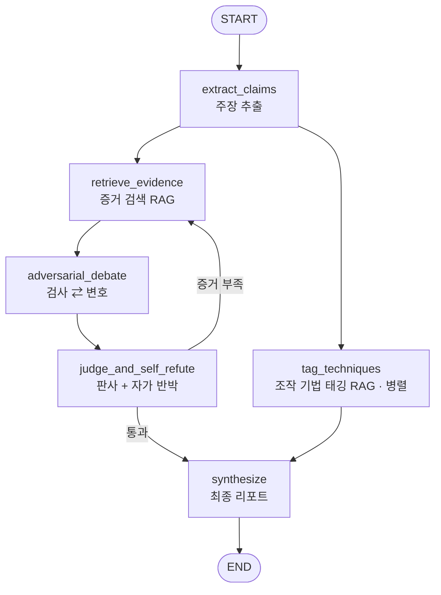

# 🕵️ 단톡방 루머 적대적 팩트체커 + 미디어 리터러시 코치

> 클라우드AI프로그래밍 기말 프로젝트 · LangChain / **LangGraph** 멀티에이전트 + RAG · LLM: **Anthropic Claude**(기본) 또는 **Google Gemini** (환경변수로 전환)

단톡방·SNS로 퍼지는 뉴스·루머를 받아 **검증 가능한 주장**을 뽑고, RAG로 근거를 모아
**검사·변호·판사 에이전트의 적대적 토론**과 **자가 반박 루프**를 거쳐
**신뢰도 등급 · 근거 사슬 · 조작 기법 태그 · 반론 카드**를 돌려주는 코치형 에이전트입니다.

단정적 라벨만 내놓는 분류기가 아니라 *"왜 헷갈리게 만드는지 + 어떻게 반박할지"* 까지
알려주어 사용자의 미디어 리터러시를 키우는 것을 목표로 합니다.

---

## 1. 워크플로우 (LangGraph StateGraph)



- **6개 노드**: `extract_claims → retrieve_evidence → adversarial_debate → judge_and_self_refute → (루프 or) synthesize`, 그리고 `tag_techniques`는 병렬 분기.
- **멀티에이전트**: 검사 / 변호 / 판사 / 기법 태거 / 반론 작성(코치) — 한 LLM에 역할별 시스템 프롬프트로 구현.
- **자가 반박 루프**: 판사가 증거 부족이라 판단하면 `retrieve_evidence`로 되돌아가며, 4가지 종료 조건(최대 루프·판사 만족·신규 증거 없음·신뢰도 수렴)으로 무한루프/진동을 막습니다.

## 2. 안전 설계 (환각·오판 방지)

- 검사·변호는 **실제 회수된 스니펫만 인용**하도록 프롬프트로 강제하고, **코드 레벨에서 지어낸 인용 id를 제거**합니다(이중 방어).
- 판사는 출처 없는·신뢰도 낮은 주장을 **감점**하고, **"불충분(판단 불가)"** 를 정식 결론으로 허용합니다.
- 출력은 단정 라벨이 아니라 **5단계 신뢰도 등급**(사실 / 대체로 사실 / 불충분 / 대체로 거짓 / 거짓·오도)입니다.
- 최종 리포트의 핵심 수치(종합 등급·근거 출처)는 **Python에서 결정론적으로 계산**하고, LLM은 자연어 반론 카드만 작성합니다.

---

## 3. 설치 (조교/채점자 안내)

> **요구사항**: Python **3.12** 권장(3.11~3.13 지원), 인터넷 연결, 그리고 LLM API 키.
> 기본 LLM 공급자는 **Anthropic Claude** 이며 `ANTHROPIC_API_KEY` 가 필요합니다.
> 임베딩은 Claude에 임베딩 API가 없어 기본적으로 **Gemini 임베딩**(`GOOGLE_API_KEY`)을
> 사용합니다 — 즉 기본 설정은 **Claude 키 + Google 키** 두 개가 필요합니다.
> Google 키 없이 쓰려면 `EMBEDDING_BACKEND=hf`(로컬 임베딩, torch 설치)로 바꾸세요.

```bash
# 1) 가상환경 생성 및 활성화
python3.12 -m venv .venv
source .venv/bin/activate          # Windows: .venv\Scripts\activate

# 2) 의존성 설치
pip install -r requirements.txt
pip install -e .                   # factchecker 패키지 설치(개발 모드)

# 3) 환경변수 설정 — .env 생성 후 API 키 입력
cp .env.example .env               # Windows: copy .env.example .env
#   .env 를 열어 ANTHROPIC_API_KEY 를 실제 키로 교체하세요(키: https://console.anthropic.com/).
#   임베딩용 GOOGLE_API_KEY 도 채우세요(또는 EMBEDDING_BACKEND=hf 로 전환).
#   Gemini 를 LLM 으로 쓰려면 LLM_PROVIDER=gemini 로 바꾸고 GOOGLE_API_KEY 만 채우면 됩니다.
```

> ⚠️ **제출본의 `.env.example` 에는 키가 `YOUR-API-KEY-HERE` 로 비워져 있습니다.**
> 실제 키는 `.env` 에만 넣으며, `.env` 는 `.gitignore` 로 커밋되지 않습니다.
> 키가 없으면 프로그램은 스택트레이스 대신 친절한 한국어 안내 후 종료합니다.

> 💡 **모델·비용 안내.** 이 에이전트는 한 번의 검증에 LLM을 여러 번 호출합니다
> (검사·변호·판사·자가반박·기법태깅·반론, 약 6~13회). 기본 Claude 모델은
> **`claude-opus-4-8`**(최고 성능, $5/$25 per 1M)입니다. 비용을 줄이려면 `.env` 에서
> `ANTHROPIC_MODEL=claude-haiku-4-5`($1/$5, 가장 저렴·빠름) 또는 `claude-sonnet-4-6`($3/$15)
> 로 바꾸세요. 레이트리밋(429/529) 시 자동 백오프 재시도하며, 필요하면
> `LLM_THROTTLE_SECONDS` 로 호출 간격을 둘 수 있습니다.
> **Gemini 무료 등급 주의:** `LLM_PROVIDER=gemini` 사용 시 무료 등급은 모델별 하루
> 요청 수(RPD)가 낮습니다(예: 하루 20회 수준). 12개 전체 평가는 호출이 많으니 한도가
> 넉넉한 키에서 실행하세요.

### (선택) 인덱스 미리 빌드
첫 실행 시 자동으로 빌드되지만, 미리 만들고 싶다면:
```bash
python -m factchecker.rag.ingest          # 변경 시에만 재빌드(멱등)
python -m factchecker.rag.ingest --force  # 강제 재빌드
```
> 인덱스(`data/.chroma/`)는 커밋하지 않습니다. **소스 JSON만 커밋**하고 각 로컬에서
> 동일하게 재빌드되므로 어떤 환경에서도 같은 결과를 얻습니다.

---

## 4. 실행

```bash
# 웹 UI (Gradio) — 브라우저에서 입력/결과 확인
python app.py

# 헤드리스 CLI
python cli.py "충격! 백신 맞으면 자석이 붙는대요. 빨리 공유하세요!"
echo "사람은 뇌의 10%만 쓴다" | python cli.py --stdin
```

## 5. 평가 재현

```bash
python -m eval.harness            # 12개 테스트셋 실행 + 지표 표 출력
python -m eval.harness --runs 2   # 2회 실행하여 판정 라벨 안정성(결정론) 점검
```
지표: **판정 정확도**(5등급 정확/±1등급 관대, "불충분" 정답 포함), **기법 태깅 F1**,
**신뢰도 보정**(자신 있게 틀린 비율 + ECE). 평가는 항상 로컬 코퍼스만 사용해 재현 가능합니다.

## 6. 테스트

```bash
pytest            # 네트워크/실제 키 없이 동작(가짜 임베딩·모킹)
```

---

## 7. 환경변수 (`.env`)

| 변수 | 기본값 | 설명 |
|---|---|---|
| `LLM_PROVIDER` | `anthropic` | `anthropic`(Claude, 기본) / `gemini`(Google Gemini) |
| `ANTHROPIC_API_KEY` | `YOUR-API-KEY-HERE` | **anthropic 일 때 필수.** Claude API 키 |
| `ANTHROPIC_MODEL` | `claude-opus-4-8` | Claude 모델. 저렴한 대안: `claude-haiku-4-5`, `claude-sonnet-4-6` |
| `ANTHROPIC_MAX_TOKENS` | `4096` | Claude 응답 최대 토큰 |
| `GOOGLE_API_KEY` | `YOUR-API-KEY-HERE` | `gemini` 공급자 또는 `EMBEDDING_BACKEND=gemini` 일 때 필수 |
| `GEMINI_MODEL` | `gemini-2.5-flash-lite` | `LLM_PROVIDER=gemini` 일 때의 채팅 모델 |
| `LLM_THROTTLE_SECONDS` | `0` | LLM 호출 간 최소 간격(초). 레이트리밋 잦으면 4~6 |
| `LLM_MAX_ATTEMPTS` | `5` | 레이트리밋(429/529) 시 지수 백오프 재시도 횟수 |
| `EMBEDDING_BACKEND` | `gemini` | `gemini`(기본, GOOGLE_API_KEY 필요) / `hf`(로컬, 키 불필요) |
| `GEMINI_EMBEDDING_MODEL` | `models/gemini-embedding-001` | Gemini 임베딩 모델 |
| `HF_EMBEDDING_MODEL` | `BAAI/bge-m3` | `EMBEDDING_BACKEND=hf` 일 때 사용 |
| `SEARCH_BACKEND` | `local` | `local`(재현 가능) / `ddg`(DuckDuckGo, 키 불필요) / `tavily`(키 필요) |
| `TAVILY_API_KEY` | (빈값) | `SEARCH_BACKEND=tavily` 일 때만 |
| `MAX_LOOPS` | `2` | 판사→검색 최대 루프 |
| `RETRIEVE_K` | `4` | 주장당 회수 스니펫 수 |
| `CONFIDENCE_DELTA_THRESHOLD` | `0.05` | 신뢰도 수렴 종료 임계값 |
| `MAX_CLAIMS` | `3` | 한 입력에서 검증할 최대 주장 수(비용 상한) |
| `LLM_TEMPERATURE` | `0.0` | 결정론을 위해 0 권장 |
| `CHROMA_DIR` | (빈값→`data/.chroma`) | 인덱스 저장 경로 |

### (선택) 라이브 웹 검색 / 로컬 임베딩
- **DuckDuckGo**(키 불필요): `pip install ddgs` 후 `.env` 에 `SEARCH_BACKEND=ddg`.
- **로컬 임베딩**(오프라인): `pip install langchain-huggingface sentence-transformers` 후 `EMBEDDING_BACKEND=hf`. (모델 다운로드 수백 MB)

---

## 8. 프로젝트 구조

```
factchecker/            # 백엔드 패키지 (저장소 루트, flat layout)
  config.py             # 환경변수/키 검증
  models.py state.py    # Pydantic 스키마 / LangGraph State(리듀서)
  llm.py                # Gemini LLM·임베딩 팩토리 + 안전한 구조화 출력
  prompts/              # 역할별 프롬프트 템플릿(.txt)
  rag/                  # 벡터스토어·인제스트·증거/기법 회수·웹검색(선택)
  nodes/                # 6개 노드 + 라우팅
  graph.py runner.py    # 그래프 조립 / 실행 API
data/                   # 증거 코퍼스 · 기법 라이브러리 · 테스트셋(소스 JSON)
eval/                   # 평가 하니스 + 지표
tests/                  # 단위 테스트(키/네트워크 불필요)
app.py cli.py           # Gradio UI / CLI 진입점
```

## 9. 범위 / 한계

- **포함(MVP+핵심)**: 주장 추출 · 증거 RAG · 적대적 검증 · 자가 반박 루프 · 조작 기법 태깅(4종) · 보정 신뢰도 + 근거 사슬 · 반론 카드 · Gradio UI · 평가.
- **제외**: AI 생성 콘텐츠 탐지 · 루머 계보 추적 · 이미지/딥페이크 검증 · (스트레치) 검증 메모리.
- 번들 코퍼스는 데모/평가용 소형 지식베이스입니다(`data/evidence_corpus/SOURCES.md` 참고). 실제 운용 시 라이브 웹 검색을 병행할 수 있습니다.

## 10. 제출(submission) 시 주의 — API 키 유출 방지

`.gitignore` 는 **git 커밋**에서만 `.env` 를 제외합니다. 폴더를 통째로 zip 으로 제출하면
`.gitignore` 가 적용되지 않아 `.env` 의 실제 키가 함께 유출될 수 있습니다. 제출 전에:

```bash
# .env / 가상환경 / 인덱스 / git 내부 파일을 제외하고 압축
zip -r submission.zip . -x '.env' -x '.venv/*' -x 'data/.chroma/*' -x '.git/*' -x '**/__pycache__/*'
```

- 제출 전 `.env` 의 키를 `YOUR-API-KEY-HERE` 로 비우거나 `.env` 를 삭제하세요(`.env.example` 만 남김).
- 로컬 검증에 사용한 키는 **폐기(rotate)** 후 새 키를 발급받는 것을 권장합니다.

## 11. 라이선스
MIT (교육용 프로젝트)
