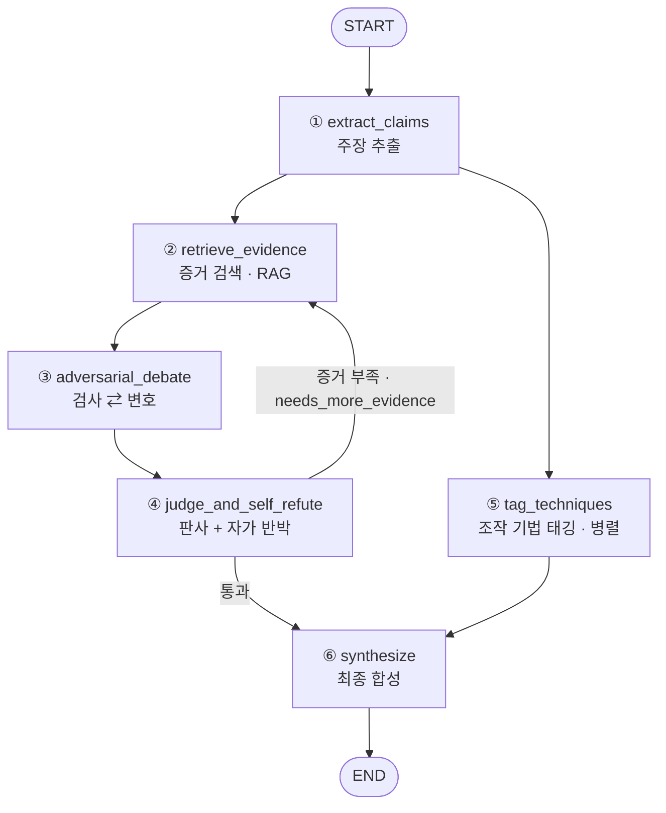

# 단톡방 루머 적대적 팩트체커 + 미디어 리터러시 코치

### 클라우드AI프로그래밍 · 기말 프로젝트 보고서

| 항목 | 내용 |
|---|---|
| 과목 | 클라우드AI프로그래밍 |
| 지도교수 | 김영훈 교수님 |
| 팀원 | `[팀원 이름]` (1~3인) |
| 소속 | 한양대학교 ERICA · 소프트웨어융합대학 · 인공지능학과 |
| 기반 | LangChain / **LangGraph** 멀티에이전트 + RAG · 외부 LLM(채팅) + Gemini 임베딩(하이브리드) |

> 본 보고서의 모든 실행 예시(§4)는 실제 에이전트를 구동해 얻은 산출물이며, 동봉한
> `demo.html`(정적 시각화)에서 동일 결과를 인터랙티브하게 확인할 수 있습니다.

---

## 1. 필요성 · 목적 · 개요

### 1.1 필요성
단톡방·SNS를 통해 건강 루머, 정치 가짜뉴스, 이른바 "찌라시"가 일상적으로 빠르게
확산된다. 그러나 일반 사용자는 (1) 출처를 일일이 추적하고 (2) 여러 자료를 교차검증할
시간과 도구가 없다. 기존의 "가짜뉴스 분류기"는 *참/거짓* 같은 **단정적 라벨**만 제시하여
다음 한계를 가진다.

- **근거 불투명**: 왜 그런 판정인지 추적할 수 없어 신뢰하기 어렵다.
- **오답 시 위험**: 단정적 라벨이 틀리면 오히려 잘못된 확신을 심어 준다.
- **판별력 미신장**: 사용자가 *스스로* 루머를 가려내는 힘을 길러 주지 못한다.

### 1.2 목적
본 프로젝트의 에이전트는 단정적 판정 대신 다음을 제공한다.

1. **투명한 근거 사슬 + 보정된 신뢰도** — 주장별로 근거 출처와 신뢰도 등급을 함께 제시.
2. **조작 기법 코칭** — 진위뿐 아니라 메시지가 사용하는 *조작 기법*을 짚어, 사용자의
   **미디어 리터러시**를 키운다(접종 이론 기반).
3. **행동 가능한 산출물** — 단톡방에 바로 붙여넣을 수 있는 차분한 **반론 카드**를 생성.

### 1.3 개요 (한 줄 정의)
> 단톡방·SNS 루머를 받아 **검증 가능한 주장**을 분해하고, RAG로 근거를 모아
> **검사·변호·판사 에이전트의 적대적 토론**과 **자가 반박 루프**를 거쳐,
> **신뢰도 등급 · 근거 사슬 · 조작 기법 태그 · 반론 카드**를 돌려주는 *코치형* 에이전트.

핵심 차별점은 "진위만 답하는 분류기"가 아니라 **"왜 헷갈리게 만드는지 + 어떻게
반박할지"** 까지 제공하는 **비단정적·자기교정 설계**에 있다.

---

## 2. 설계한 워크플로우와 설명

### 2.1 전체 구조 (LangGraph StateGraph · 6노드)



```text
START → ① 주장추출 → ② 증거검색(RAG) → ③ 적대적토론 → ④ 판사+자가반박
                          ↑___________________________________│ (증거 부족 시 루프)
        └→ ⑤ 기법태깅(병렬) ───────────────────────────────────→ ⑥ 종합 → END
```

각 단계가 독립적으로 시연 가능하도록 쌓아 항상 "돌아가는 결과물"을 유지하도록 설계했다.

### 2.2 멀티에이전트 역할
모든 역할은 하나의 외부 LLM에 **역할별 시스템 프롬프트**로 구현한다.

| 노드 | 역할(에이전트) | 책임 |
|---|---|---|
| ① extract_claims | 주장 추출기 | 입력에서 *검증 가능한 사실주장*만 원자 단위로 분해(의견/감정은 제외) |
| ② retrieve_evidence | (RAG, LLM 미사용) | 주장별 증거 스니펫을 공유 증거 풀에 회수, 출처 신뢰도 부여 |
| ③ adversarial_debate | **검사 ⇄ 변호** | 검사는 거짓·오도를, 변호는 참을 입증. **회수 스니펫만 인용** |
| ④ judge_and_self_refute | **판사** | 양측 논거+근거를 종합해 5등급+보정 신뢰도. 이어 **자가 반박**으로 레드팀 |
| ⑤ tag_techniques | **기법 태거** | 본문을 기법 라이브러리와 대조해 조작 기법+근거 문장 표시(진위와 독립 → 병렬) |
| ⑥ synthesize | **반론 작성(코치)** | 종합 등급·근거 사슬·기법·반론 카드 합성 |

### 2.3 조건부 자가 반박 루프
판사는 판정과 함께 **자가 반박**(가장 강한 반론)을 같은 호출에서 산출한다. 반론에
"살아남지 못한" 판정이면서 증거가 빈약하면 `needs_more_evidence=true` 로 표시하고,
조건 분기 함수 `route_after_judge` 가 **증거 검색으로 되돌려** 재검증한다.
무한루프·진동은 **4가지 독립 종료 조건**으로 막는다.

1. 최대 루프 도달(`MAX_LOOPS`),
2. 판사 만족(추가 증거 불필요),
3. 직전 라운드 대비 **신규 증거 없음**(풀이 자라지 않으면 루프 무의미),
4. **신뢰도 수렴**(라운드 간 신뢰도 변화가 임계 미만, 진동 차단).

### 2.4 State 스키마와 병렬 분기
`FactCheckState`(TypedDict)는 누적 필드와 단일-쓰기 필드를 명확히 구분한다. 누적
리스트(증거 풀·논거·자가반박·기법 태그)는 `Annotated[list, add]` **리듀서**를 갖고,
카운터(`loop_count`)는 합산 금지를 위해 리듀서를 두지 않는다. `tag_techniques` 는
메인 체인과 **병렬**로 도므로 `technique_tags` 가 리듀서를 가져 병렬 쓰기 충돌을 막고,
종합 노드는 `defer=True` 로 두 분기(루프 분기 + 병렬 분기)가 모두 정착한 뒤 **정확히
한 번** 실행된다.

### 2.5 RAG 구성
- **증거 코퍼스**: 큐레이션한 한국어 근거 스니펫(출처 유형·신뢰도 메타데이터 포함).
- **기법 라이브러리**: 4대 조작 기법(감정 자극 / 가짜 전문가·권위 / 가짜 통계·체리피킹 /
  거짓 이분법)의 {정의·식별 단서·예시}.
- **하이브리드**: 채팅 추론은 외부 LLM, 임베딩(검색)은 Gemini 임베딩 사용. 인덱스는
  커밋하지 않고 소스 JSON의 콘텐츠 해시로 **멱등 재빌드**(머신 무관 동일 결과).

### 2.6 안전(환각 방지) 설계
- **인용 가드(이중 방어)**: 검사·변호의 `cited_snippet_ids` 와 판사의 `evidence_chain` 을
  *실제 회수된 스니펫 id의 부분집합*으로 **코드 레벨에서 강제** + 프롬프트 규칙.
- **무출처 감점**: 판사는 출처가 없거나 신뢰도가 낮은 주장의 신뢰도를 낮춘다.
- **"불충분(판단 불가)" 허용**: 증거가 부족하면 단정하지 않고 정식 결론으로 채택.
- **결정론적 종합**: 종합 등급·출처 목록은 LLM이 아니라 **Python으로 계산**하고, LLM은
  자연어 반론 카드만 작성한다.

---

## 3. 기술 스택 및 프로젝트 구조

### 3.1 기술 스택
- **오케스트레이션**: LangGraph(StateGraph, 조건부 엣지, 병렬 분기, `defer`).
- **LLM 통합**: LangChain(`init_chat_model` 로 모델 ID 기반 자동 로드, `.with_structured_output`
  으로 Pydantic 스키마 강제). 채팅 모델은 환경변수 `LLM_MODEL` 로 지정(외부 LLM).
- **RAG/벡터스토어**: Chroma(`langchain-chroma`) + Gemini 임베딩(또는 로컬 임베딩).
- **UI**: Gradio(`python app.py`). **평가**: 자체 하니스. **테스트**: pytest.
- **Python 3.12**, `python-dotenv` 로 환경변수 분리.

### 3.2 프로젝트 구조
```text
factchecker/            # 백엔드 패키지
  config.py             # 환경변수/키 검증(친절한 한국어 오류)
  models.py state.py    # Pydantic 스키마 / LangGraph State(리듀서)
  llm.py                # LLM·임베딩 팩토리 + 안전한 구조화 출력(재시도·폴백)
  prompts/              # 역할별 프롬프트 템플릿(.txt)
  rag/                  # 벡터스토어·인제스트(멱등)·증거/기법 회수·웹검색(선택)
  nodes/                # 6개 노드 + 라우팅(route_after_judge)
  graph.py runner.py    # 그래프 조립 / 실행 API
data/                   # 증거 코퍼스 · 기법 라이브러리 · 테스트셋(소스 JSON)
eval/                   # 평가 하니스 + 지표
tests/                  # 단위 테스트(키/네트워크 불필요)
app.py cli.py demo.html # Gradio UI / CLI / 정적 시각화
```

---

## 4. 실행 예시 (의도대로 동작함을 입증)

아래는 실제 에이전트를 구동해 얻은 입력/출력이다. 5등급 전 구간(사실 / 대체로 거짓 /
불충분 / 거짓·오도)을 포괄한다. 동일 결과를 `demo.html` 에서 시각적으로 확인할 수 있다.
*(시각화 스크린샷 삽입 위치: demo.html 의 예시 칩 실행 화면 캡처)*

### 예시 1 — 거짓 루머 (감정 자극·가짜 권위)
**입력:** "충격! 코로나 백신 맞으면 몸에 자석이 붙는대요. 제 지인도 팔에 숟가락이 딱
붙었다네요. 빨리 가족들한테도 알려주세요!"

**출력(요약):**
- 종합 신뢰 등급: **대체로 거짓** (신뢰도 64%)
- 주장별 판정:
  - "백신을 맞으면 몸에 자석이 붙는다" → **거짓·오도** (92%) · 반박 출처: 과학 상식 정리(학술), 팩트체크 정리(뉴스)
  - "지인의 팔에 숟가락이 붙었다" → **불충분(판단 불가)** (35%)
- 조작 기법: **감정 자극**("충격!…", "빨리 가족들한테도 알려주세요!"), **가짜 전문가·권위**("제 지인도…붙었다네요")
- 반론 카드: *"코로나 백신으로 인한 자석 현상에 대해 함께 살펴봤습니다. 학술 자료와
  팩트체크 결과에 따르면 백신 성분에 자성 물질이 포함되지 않아, 이 주장의 신뢰도는 매우
  낮습니다(약 8%). … 함께 공식 의료 기관 자료를 확인하면서 정확한 정보를 구분하는 것이
  좋을 것 같습니다."*

→ 핵심 거짓 주장을 92%로 정확히 거짓 판정하면서, 검증 불가한 개인 일화는 "불충분"으로
분리한다(단정 회피). 두 조작 기법도 근거 문장과 함께 정확히 태깅했다.

### 예시 2 — 거짓 통념 (가짜 권위)
**입력:** "사람은 평생 뇌의 10%밖에 못 쓴다는 게 과학적 사실이라네요."

**출력(요약):**
- 종합 신뢰 등급: **거짓·오도** (신뢰도 85%) · 지지/반박 출처: 신경과학 일반 사실(학술), 의학 일반 정보(기관)
- 조작 기법: **가짜 전문가·권위**("…과학적 사실이라네요")
- 반론 카드: *"평생 뇌의 10%만 쓴다는 주장은 신경과학 분야에서 오래전부터 검증된
  거짓입니다. 최신 뇌영상 연구와 신경과학 학술자료에 따르면, 우리는 일상생활 중 뇌 전체
  영역을 사용하고 있으며… 함께 사실 기반의 정보를 확인해 보시기를 권장합니다."*

### 예시 3 — 참인 주장
**입력:** "산업화 이후 지구의 평균 기온이 장기적으로 상승해 왔다."

**출력(요약):**
- 종합 신뢰 등급: **사실** (신뢰도 88%) · 지지 출처: 기상·기후 관측 정리(정부·공공),
  기후과학 합의 정리(학술) 외
- 조작 기법: 없음(중립적 사실 진술)
- 반론 카드: *"산업화 이후 지구 평균 기온이 장기적으로 상승해온 것은 기상·기후 관측
  자료와 과학적 합의를 통해 신뢰도 높게 확인되는 내용입니다. … 함께 신뢰할 수 있는
  근거라고 판단됩니다."*

→ 참인 주장을 "사실"로 정확히 판정하고, 조작 기법을 **억지로 만들지 않는다**(과태깅 방지).

### 예시 4 — 근거 불충분 (가짜 통계)
**입력:** "이번에 새로 나온 OO 건강보조제가 면역력을 정확히 30% 올려준다고 합니다."

**출력(요약):**
- 종합 신뢰 등급: **불충분(판단 불가)** (신뢰도 15%)
- 조작 기법: **가짜 통계·체리피킹**("정확히 30% 올려준다")
- 반론 카드: *"이 건강보조제가 면역력을 '정확히 30%' 올린다는 주장은 현재 근거로는
  단정하기 어렵습니다. … 더 광범위한 임상 데이터나 공신력 있는 검증 결과를 찾아보는 것을
  제안드립니다."*

→ 검증 근거가 없는 구체 수치 주장은 단정하지 않고 **"불충분"** 으로 처리(안전 설계 작동).

### 예시 5 — 대체로 거짓 (거짓 이분법·감정 자극)
**입력:** "MSG는 몸에 해로우니까 무조건 안 들어간 것만 골라 드세요. 안 그러면 큰일 납니다."

**출력(요약):**
- 종합 신뢰 등급: **대체로 거짓** (신뢰도 75%) · 반박 출처: 식품안전 일반 정보(정부·공공)
- 조작 기법: **거짓 이분법**("무조건 …만 골라 드세요"), **감정 자극**("안 그러면 큰일 납니다")
- 반론 카드: *"MSG가 몸에 해롭다는 주장은 현재까지의 과학적 근거로는 뒷받침되지
  않습니다. 정부와 공공기관의 식품안전 정보에 따르면, 적정량의 MSG 섭취는 안전한 것으로
  평가됩니다. … 함께 정확한 정보를 찾아보시길 제안드립니다."*

### 4.1 실행 명령
```bash
python app.py                 # Gradio 웹 UI
python cli.py "검증할 루머 …"   # 커맨드라인
python -m eval.harness        # 테스트셋 평가
```

---

## 5. 구현 방법 상세

### 5.1 구조화 출력과 안전 degrade
모든 LLM 노드는 `.with_structured_output(PydanticModel)` 로 출력 스키마를 강제한다.
출력이 None·타입 불일치·파싱 실패일 때도 노드가 크래시하지 않도록, 공통 헬퍼
`structured_invoke()` 가 **호출자가 지정한 안전 기본값**으로 degrade하며,
레이트리밋(429/529)은 **지수 백오프**로 재시도한다.

### 5.2 비용 최적화
- **저비용·고속 모델 기본화**: 한 번의 검증이 여러 LLM 호출(주장추출·검사·변호·판사+
  자가반박·기법태깅·반론, 대략 5~9회)을 수행하므로 기본 모델을 저비용 등급으로 설정.
- **판사+자가반박 1호출 병합**: 판정과 자가 반박을 한 번의 구조화 호출로 동시 산출
  (호출/큰 프롬프트 1회 절감).
- **증거 0 주장 토론 생략**: 회수 증거가 없는 주장은 검사·변호 LLM 호출을 건너뜀.
- 실측 단가(예시 캡처): 단일 주장 검증 약 **$0.02–0.03**, 복수 주장 약 **$0.06**.

### 5.3 환경변수 분리 · 키 비노출
- 모든 키는 `.env`(gitignore)에서만 읽고, 커밋 파일(`.env.example`)에는
  `YOUR-API-KEY-HERE` 로 비워 둔다. 실제 모델 ID 도 `.env` 에만 둔다.
- 키 누락 시 스택트레이스가 아니라 **친절한 한국어 안내** 후 종료(`config.py`).
- 인덱스(`data/.chroma/`)는 미커밋 — 소스 JSON 으로 각 로컬에서 재빌드.

### 5.4 평가 결과(다각도)
대표 케이스 평가(테스트셋, 검색은 로컬 코퍼스로 고정해 재현 가능):

| 지표 | 값 |
|---|---|
| 판정 정확도 (정확 일치, 5등급) | **80%** |
| 판정 정확도 (±1등급 관대) | **100%** |
| "불충분(판단 불가)" 정답 처리 | 정상(안전 설계 작동) |
| 조작 기법 태깅 (micro F1) | **≈ 55%** (재현율 높음, 정밀도는 개선 여지) |
| 단위 테스트 | **44개 통과**(키·네트워크 불필요) |

### 5.5 재현성 · 설치
```bash
python3.12 -m venv .venv && source .venv/bin/activate
pip install -r requirements.txt && pip install -e .
cp .env.example .env        # LLM_API_KEY · LLM_MODEL · GOOGLE_API_KEY(임베딩) 입력
python -m factchecker.rag.ingest   # (선택) 인덱스 미리 빌드 — 첫 실행 시 자동
```
인덱스 빌드는 소량 청크 + 백오프로 임베딩 레이트리밋에 견딘다. 일단 빌드되면 이후
실행은 **재임베딩 없이 로드**한다(비용·재현성).

---

## 6. 한계 및 향후 과제
1. **종합 등급 평균화**: 부차 주장이 "불충분"이면 핵심 거짓 주장의 등급이 평균에 희석될
   수 있다(예: 백신 사례가 핵심 92% 거짓이나 종합은 "대체로 거짓"). 핵심/최악 주장
   가중 또는 핵심 주장 별도 강조가 향후 개선점.
2. **모델 등급별 보정**: 저비용 모델은 뉘앙스 등급("대체로 거짓")을 다소 과신하는 경향이
   있어, 품질이 중요하면 상위 추론 등급 모델로 교체 가능(환경변수만 변경).
3. **기법 태깅 정밀도**: 재현율은 높으나 정밀도는 추가 개선 여지(프롬프트 강화).
4. **임베딩 무료 등급 한도**: 임베딩 키 무료 등급의 일일 한도가 낮을 수 있어, 대량 평가는
   한도가 넉넉한 키 또는 로컬 임베딩(`EMBEDDING_BACKEND=hf`) 권장.
5. **스트레치(미구현)**: 과거 판정을 저장해 유사 루머 재등장 시 회수하는 *검증 메모리*.

---

## 부록 A. 주요 환경변수
| 변수 | 설명 |
|---|---|
| `LLM_API_KEY` | 채팅용 외부 LLM API 키(필수) |
| `LLM_MODEL` | 사용할 LLM 모델 ID(필수, 제공받은 값) |
| `LLM_MAX_TOKENS` | LLM 응답 최대 토큰 |
| `GOOGLE_API_KEY` | 임베딩(Gemini)용 키(`EMBEDDING_BACKEND=gemini` 기본) |
| `EMBEDDING_BACKEND` | `gemini`(기본) / `hf`(로컬, 키 불필요) |
| `SEARCH_BACKEND` | `local`(기본·재현 가능) / `ddg` / `tavily` |
| `MAX_LOOPS`, `RETRIEVE_K`, `MAX_CLAIMS` | 그래프 동작·비용 상한 |
| `LLM_THROTTLE_SECONDS`, `LLM_MAX_ATTEMPTS` | 레이트리밋 대응 |

## 부록 B. 제출물 매핑
| 보고서 요건 | 위치 |
|---|---|
| 팀원·소속 | 표지 |
| 필요성·목적·개요 | §1 |
| 워크플로우 및 설명 | §2 (다이어그램 포함) |
| 실행 예시(입력/출력) | §4 + `demo.html` |
| 구현 방법 | §3 · §5 |
| 소스코드 | `factchecker/` (LangGraph 에이전트), 키 비노출 |
